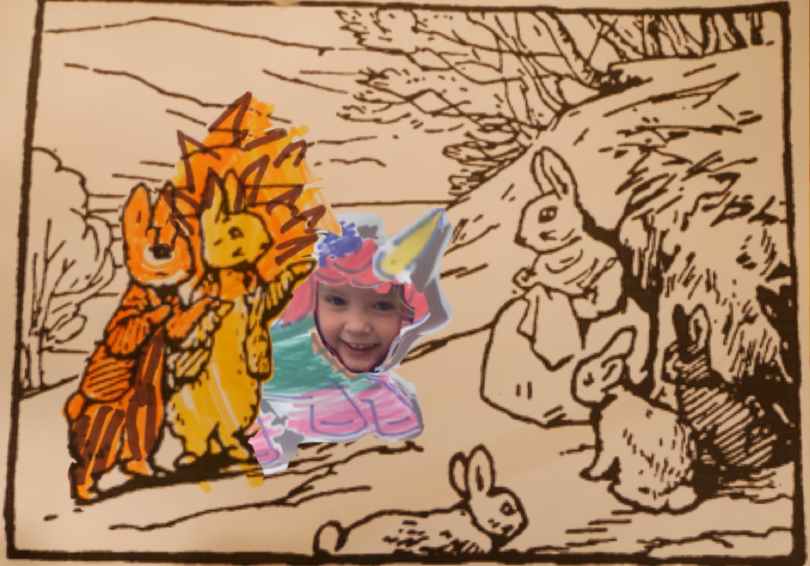

The sunshine was still warm and slanting on the hill pastures. Half way up, Cottontail was sitting in her doorway, with four half-grown little rabbits playing about her; one black and the others pink.

–"Hvem er dere?" sa Cottontail 
–"Peter, Jack og Lillian!" 
–"Jeg kjente dere ikke igjen som Tiger, løve og enhjørning Lillian, men nå som jeg ser at det er deg, så husker jeg at vi fant en hel skipsskiste etter tipp-tipp-tipp-oldefaren din på kostymelageret på teateret." sa Cottontail 
–"Hvilket teater? Det ved fossen?"
–"Ja, men jeg tok med én ting fra kista. Vil du se hva det er?" sa Cottontail 
–"Ja!" sa Lillian 
–"Et sverd!" sa Lillian 
–"Au! Blod! Skarpt sverd!" sa Lillian 

<!--
–"Et sverd!" sa Lillian 
–"Et sverd!" sa Lillian  -->
<!-- "ja" sa Cottontail 
–"Et sverd!" sa Lillian 
–"Ja" sa Cottontail 
–"Et sverd!" sa Lillian  -->

<!-- Cottontail had seen Tommy Brock passing in the distance. Asked whether her husband was at home she replied that Tommy Brock had rested twice while she watched him. -->
<!--
He had nodded, and pointed to the sack, and seemed doubled up with laughing.—"Come away, Peter; he will be cooking them; come quicker!" said Benjamin Bunny. -->

<!-- They climbed up and up; -->

<!-- —"He was at home; I saw his black ears peeping out of the hole." "They live too near the rocks to quarrel with their neighbours. Come on, Cousin Benjamin!" -->

